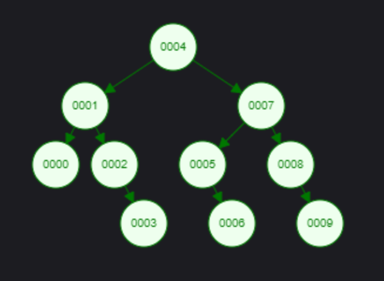

# Binary Search Tree Projesi

## [7, 5, 1, 8, 3, 6, 0, 9, 4, 2]

- Dizi once kucukten buyuge olarak siralanir.
  [0, 1, 2, 3, 4, 5, 6, 7, 8, 9]

- Root 4'tur.
  - Solunda 1, saginda 7 bulunur.
    - 1'in solunda 0, saginda 2 bulunur.
      - 2'nin saginda 3 bulunur.
    - 7'nin solunda 5, saginda 8 bulunur.
      - 5'in saginda 6 bulunur.
      - 8'in saginda 9 bulunur.

